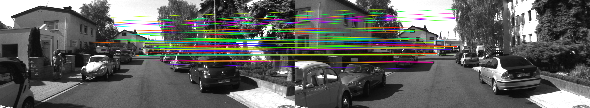

# Geometric Verification

In this chapter, we will build off of the feature matching example from the previous chapter by utilizing feature matches, together with information about the camera, to infer camera motion between the images being compared. We will see a few new concepts including camera parameters, consensus algorithms, and estimators. 

## Camera Parameters

In order to relate image features to objects in the 3D scene captured by the camera, we require a parameterization to convert between 3D space and image coordinates. We will briefly intrinsic and extrinsic parameters and how they work together to achieve this mapping. 

### Intrinsics

The pinhole camera model a common camera parameterizeration, which is an idealized model that constructs the projected image based on how light beams would pass through a point aperature. This model does not account for the challenges of real lenses (e.g. distortion, blurring) but is a reasonable approximation of the geometric mapping between 3D space and image space.

The parameters of interest are the focal length $(f_x, f_y)$,  which describes the distance between the projected image and the camera, and the principal point $(c_x, c_y)$ which determines the center of the image plane. These together comprise the intrisics matrix:

```math
K = \left[
        \begin{array}{cc}
        f_x &   0 & c_x \\
          0 & f_y & c_y \\
          0 &   0 &   1
        \end{array}
    \right]
```

Most cameras also add lens distortion to the image. This distortion can make lines that are straight in reality appear curved in the images (like traffic signs poles). This type of distortions can be taken into account using polynomial function of a certain degree. The degree of the polynomial depends on how distorted the image is in reality. The coefficients are usually written as $k_i$ if they model radial distortion and $p_i$ if they model tangential distortion.

The intrinsic parameters are unique to each camera, and can be estimated through a calibration procedure like the one described in [OpenCV docs](https://docs.opencv.org/4.x/dc/dbb/tutorial_py_calibration.html) or [Matlab](https://www.mathworks.com/help/vision/ug/using-the-single-camera-calibrator-app.html). Many cameras are factory calibrated and the intrinsics are provided along with the purchased camera.

### Extrinsics

While the intrinsics provide a mapping between image coordinates and camera coordinates, we need to also account for the fact that the camera may be physically located in different poses with respect to objects in the scene. Extrinsic parameters account for this by determining the camera's pose in the scene defined by a rotation and translation. If a reference frame is known (e.g. a checkerboard calibration pattern), then we can try to compute the camera's pose in the reference frame. Oftentimes there is no such reference frame, but we can still try to compute the _relative pose_ of the camera between two images of the same scene. We will leverage this idea in the code below.

## Estimators - Eight Point Algorithm

In the previous chapters we saw how to extract keypoint features from an image and match them to the keypoint features of another image. Using these matches along with the camera intrinsic parameters discussed in the last section, it is possible to estimate the extrinsic camera matrix discussed above. With only the information about keypoint feature matches, however, it is only posiible to recover the transformation matrix up to scale. Meaning that we do not know how many meters the camera moved between frames. We can only recover the movement *direction* expressed as a unit vector along with the rotation matrix. 

To do this we need an estimator. The role of the estimator is to use the keypoint feature matches and solve a linear equation that will ultimately result in the pose of the camera. The equation is defined using [epipolar geometry](https://en.wikipedia.org/wiki/Epipolar_geometry).

The Eight Point Algorithm requires 8 point correspondences (as the name suggests) to estimate an [Essential matrix](https://en.wikipedia.org/wiki/Essential_matrix) that relates corresponding points in stereo images assuming that the cameras satisfy the pinhole camera model. The Essential matrix can be decomposed into several poses using [Singular Value Decomposition (SVD)](https://en.wikipedia.org/wiki/Singular_value_decomposition). To choose the correct solution, the cheirality check is often employed, which uses the computed camera pose to triangulate 3D points from the keypoints from the images. The depth of the 3D points must be positive in order for the points to lie in front of both cameras. The pose that produces the highest number of triangulated points in front of the cameras is considered the true solution of the estimation.

## Consensus Algorithms

As you may have noticed visually inspecting the feature matches betwen the two images, the matches are not always correct, even when we use symmetric feature matching. In order to infer the correct camera motion between the two images, we need some means of dealing with the fact that there are incorrect matches amongst the correct matches. We lean on the power of _consensus algorithms_ to achieve this. Furthermore, these algorithms help us deal with the fact that the keypoint feature locations in the images are 'noisy'. 

Random sample consensus (RANSAC) is an iconic consensus algorithm that seeks to fit a model to the correct data (inliers) while being robust to the presence of outliers.

In general, RANSAC algorithms require a set of data points and an estimator that uses a subset of the data to compute a score. RANSAC randomly chooses subsets from all the data points to feed the estimator. The algorithm stops when the estimaotr produces a score below a certain threshold, in which case we consider that the solution is sufficiently accurate, or when a certain number of iterations has been reached. 

RANSAC

**TODO:** Add a statement about ARRSAC and its relation to RANSAC, since it's what is used in the code.


## Running the program

Make sure you are in the Rust CV mono-repo and run:

```bash
cargo run --release --bin chapter5-geometric-verification
```

If all went well you should have a window and see this:



## The code

### Feature Matching

The initial code will look familiar from the previous chapter on feature matching. We again open two images taken with the same camera in the same scene from the Kitti dataset, extract Akaze features for each of them, and compute the symmetric feature matches between them.

```rust
let src_image_a = image::open("res/0000000000.png").expect("failed to open image file");
let src_image_b = image::open("res/0000000014.png").expect("failed to open image file");

let akaze = Akaze::default();

let (key_points_a, descriptors_a) = akaze.extract(&src_image_a);
let (key_points_b, descriptors_b) = akaze.extract(&src_image_b);
let matches = symmetric_matching(&descriptors_a, &descriptors_b);
```


### Camera Intrinsics

Our goal is to utilize the feature matches to infer the motion of the camera in the scene. To do that, we require the intrinsic parameters of the camera used to capture the photos. Luckily for us, that information is provided with the Kitti dataset. We instantiate a camera instance with the provided focal length and principal point:

```rust
let camera = CameraIntrinsicsK1Distortion::new(
        CameraIntrinsics::identity()
            .focals(Vector2::new(9.842439e+02, 9.808141e+02))
            .principal_point(Point2::new(6.900000e+02, 2.331966e+02)),
        -3.728755e-01,
    );
```

The last value is the $k_1$ distortion coefficient, as the name `CameraIntrinsicsK1Distortion` suggests. 

### Consensus and Estimation Setup

We need to use some consensus algorithm to approximate a good model for our data. In this example we use ARRSAC and we initialize the sampling process using [xoshiro256++](https://vigna.di.unimi.it/papers.php#BlVSLPNG) Pseudo Random Number Generator (PRNG). This consensus algorithm requires a model that is used to fit the input data. We use the Eight-Point algorithm. 

```rust
    let mut consensus = Arrsac::new(1e-7, Xoshiro256PlusPlus::seed_from_u64(0));

    let estimator = EightPoint::new();
```

By using `seed_from_u64(0)` we ensure that we get the same results each time we run this experiment.


### Image Coordinates to Bearing

In the image coordinates, the Origin is in the top left corner of the image, the positive direction for the $X$ axis is to the right and the positive $Y$ axis direction is down. The keypoints that were extracted and matched are expressed in these coordinates. For the purpose of estimating the relative pose between to images, we need the keypoint locations to be expressed as bearings. By bearings, we refer to the direction that the light came from in the camera reference frame. The next lines of code do this convertion only for keypoints for which we found a match. 

```rust
    let matches = matches
        .iter()
        .map(|&[a, b]| {
            FeatureMatch(
                camera.calibrate(key_points_a[a]),
                camera.calibrate(key_points_b[b]),
            )
        })
        .collect_vec();
```

The conversion is done by using the camera model parameters that were provided by the Kitti dataset. 

### Pose Estimation (up to scale)

The actual work is done in the follosing lines of code:

```Rust
    let (pose, inliers) = consensus
        .model_inliers(&estimator, matches.iter().copied())
        .expect("we expect to get a pose");
```

Under the hood, there is a lot going on here. 

Using the consensus algorithm, ARRSAC, we randomly select correspondences to feed into the estimation algorithm. Using these matches, the estimator first computes an [Essential matrix](https://en.wikipedia.org/wiki/Essential_matrix) which contains information about the movement of the camera between frames. In order to obtain the Pose of the second image relative to the first, the Essential matrix is decomposed using SVD and we obtain 4 possible solutions for the Pose. To select the best solution, the algorithm computes residuals for each solution using a cheirality check. The solution with the smallest residual is considered to be the correct one. At the same time, the matches that do not pass the cheirality check are filtered out.

The 'pose' and 'inliers' results represnt the Pose solution with the smallest residuals and the matches indexes that survived the cheirality check.

In the following, we print the resulting translation form the pose:

```rust
    let translation = -pose.isometry().translation.vector;
    println!("camera moved forward: {}", translation.z);
    println!("camera moved right: {}", translation.x);
    println!("camera moved down: {}", translation.y);
```

The pose describes the direction that the the world moves to become the reference frame. As such, we need to negate the translation in order to obtain the movement direction of the second camera relative to the first.

The program will output:

```bash
camera moved forward: 0.9998886290482446
camera moved right: 0.005067204056943098
camera moved down: 0.014037554739600156
```

Note that these values reprent a unit vector. Since the actual scale of the environment cannot be recovered from the matches alone, we do not know how much the vehicle actually moved in meters. We only know that the vehicle moved in the forward direction (that is, the $Z$ axis) the most. 

### Inlier Matches

 The next line of code filteres the original mathces to obtain only the ones that fit the obtained Pose.

```rust
    let matches = inliers.iter().map(|&inlier| matches[inlier]).collect_vec();
```

### Drawing lines for each match

This part is broken up to make it more manageable.

```rust
    for (ix, &FeatureMatch(a_bearing, b_bearing)) in matches.iter().enumerate() {
        // Compute a color by rotating through a color wheel on only the most saturated colors.
        let ix = ix as f64;
        let hsv = Hsv::new(RgbHue::from_radians(ix * 0.1), 1.0, 1.0);
        let rgb = Srgb::from_color(hsv);

```

At this part we are iterating through each match. We also enumerate the matches so that we have an index. The index is converted to a floating point number. The reason we do this is so that we can assign a color to each index based on the index. This is done by rotating the [hue of an HSV color](https://en.wikipedia.org/wiki/HSL_and_HSV) by a fixed amount for each index. The HSV color has max saturation and value, so we basically get a bright and vivd color in all cases, and the color is modified using the radians of the hue. From this we produce an [SRGB color](https://en.wikipedia.org/wiki/SRGB), which is the color space typically used in image files unless noted otherwise.

```rust
        // Draw the line between the keypoints in the two images.
        let point_to_i32_tup =
            |point: KeyPoint, off: u32| (point.x as i32 + off as i32, point.y as i32);
        drawing::draw_antialiased_line_segment_mut(
            &mut canvas,
            point_to_i32_tup(camera.uncalibrate(a_bearing).unwrap(), 0),
            point_to_i32_tup(
                camera.uncalibrate(b_bearing).unwrap(),
                rgba_image_a.dimensions().0,
            ),
            Rgba([
                (rgb.red * 255.0) as u8,
                (rgb.green * 255.0) as u8,
                (rgb.blue * 255.0) as u8,
                255,
            ]),
            pixelops::interpolate,
        );
    }

```

Remember that, in a previous step, we converted the keypoint feature locations from their pixel coordinates to bearings. In order to display the keypoints on the images, we need to 'uncalibrate' the bearing back to pixel coordinates. We create a closure that converts a keypoint's point, into integers. It also adds a provided offset to the X value. This will be used to offset the points on image B when drawing match lines.

The next step is that we call the draw function. Note that for the first point we use the key point location from image A in the match and for the second point we use the key point location from image B in the match. Of course, we add an offset to image B since it is off to the right of image A. The `rgb` value is in floating point format, so we have to convert it to `u8`. This is done by multiplying by 255 and casting (which rounds down). The alpha value is set to 255 to make it totally solid. Unlike the previous chapters, this function doesn't support blending/canvas operation, so we just set the alpha to 255 to avoid it acting strange.

### Display the resulting image

The rest of the code has been discussed in previous chapters. Go back and see them if you are curious how it works. All it does is save the matches image out and open it with your system's configured image viewer.

## End

This is the end of this chapter.